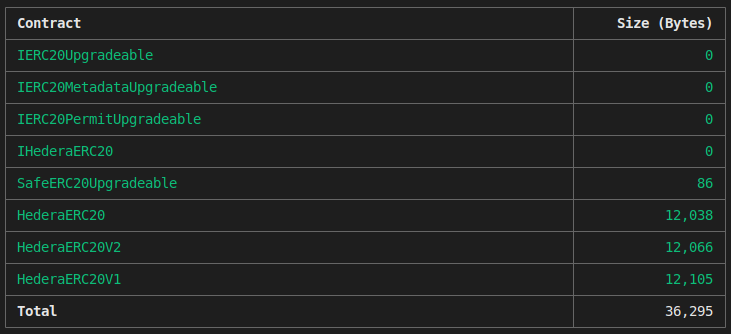

# Hardhat contract size

This plugin for Hardhat displays the contract size of all or a selection of Smart Contracts in Bytes.

    https://hardhat.org/

## 👷‍♀️ Installation
Install the plugin with npm

    npm install hardhat-contract-size --save-dev

Add the plugin to your hardhat.config.js file

    require('hardhat-contract-size');

## ▶️ Usage
The command can be executed without any arguments to display the size of all contracts in the project with the default settings.

    npx hardhat contract-size

## ⚙️ Configuration
You don’t need to add anything to the config file to get started, it will run every time you compile by default

You can modify the hardhat.config.js file with the following options:

    contractSize: {
        sort: "size,asc",
        checkMaxSize: true,
        contracts: ["HTS.sol"],
        disambiguatePaths: false,
        ignoreMocks: true,
        except: ["ERC20*."], // We want to exclude all contracts that start with ERC20,
        sizeInBytes: false
    }

You can pass some arguments to the command, for example:

    npx hardhat contract-size --contracts ExampleContract1,ExampleContract2 --ignore-mocks

| Option | Description | Default |
|--|--|--|
| `sort` | Sort table entries by name or size and ascendant or descendant order. The table is sorted by size ascendant by default. | `size,asc` |
| `checkMaxSize` | Check that the smart contracts aren't bigger than the allowed maximum contract size of the Ethereum Mainnet (`24 KiB = 24576 bytes`) | `false` |
| `contracts` | Array of string matchers (regex) to determine what contracts to include `*.Mock.sol,ERC20`. | `[]` |
| `disambiguatePaths` | Whether to output the full path to the compilation artifact (relative to the Hardhat root directory). | `false` |
| `ignoreMocks` | Wether to ignore contracts that have a name that ends with "Mock". | `false` |
| `runOnCompile` | Wether to run the plugin when contracts are compiled.   This option is only available under the `hardhat.config.js` file | `true` |
| `except` | Comma separated matchers (regex) to determine what contracts to ignore `ERC20*.,HTS*.` | `[]` |
| `sizeInBytes` | Shows the size of the contracts in Bytes, by default the size is shown in `Kib`. | `false` |

 
### 👀 Example Configuration

    require("@nomicfoundation/hardhat-toolbox");
    require("hardhat-contract-size");
    // See more at https://hardhat.org/hardhat-runner/docs/config
    /** @type import('hardhat/config').HardhatUserConfig */
    module.exports = {
    solidity: {
        version: "0.8.10",
        settings: {
        optimizer: {
            enabled: true,
            runs: 100,
        },
        },
    },
    contractSize: {
        except: ["@openzeppelin"],
        disambiguatePaths: true,
        sizeInBytes: true,
    }
    };

### Sort
By default the plugin sort contracts by its size ascendant, but can be changed to order by name or size ascendant or descendant.

    npx hardhat contract-size --sort size,asc

### Check maximum contract sizes
The plugin can be used to check that the smart contracts aren't bigger than the allowed maximum contract size of the Ethereum Mainnet (`24 KiB = 24576 bytes`). For example this can be used, to make a CI/CD pipeline fail, if a contract is bigger than allowed.

    npx hardhat contract-size --check-max-size

If another size limit than the default one should be checked, it can be given as argument to the option. For example to set the maximum to `48 KiB` the following command can be used:

    npx hardhat contract-size --check-max-size 48

If one or more of the contracts are bigger than the maximum size, an error message will de displayed.

### Contracts
Choose the the contracts which match with names provided. It is possible to specify only the name or indicate the full name with the extension `.json`.

    npx hardhat contract-size --contracts ExampleContract1,ExampleContract2.json

### Disambiguate paths
If it is marked as true, the name of the contract will be displayed, otherwise, the full path will be displayed (relative to the Hardhat root directory).

    npx hardhat contract-size --disambiguate-paths

For example:

| Parameter Value | Result |
|--|--|
| `false` | Contract |
| `true` | /contracts/Contract.sol |

### Ignore mocks
Mock contracts are used to improve the testing of smart contracts. As they are only used during testing and will not be deployed, it can be useful to ignore when calculating the contract sizes. When the option is used, all contract which names are ending with Mock will be ignored. This can especially be useful in combination with the `--check-max-size` option.

    npx hardhat contract-size --ignore-mocks

### Show in bytes
Shows the size of the contracts in Bytes, by default the size is shown in Kib

    npx hardhat contract-size --size-in-bytes

### Except
Excludes the contracts which matched with the regular expression provided. It is possible to specify only the name or indicate the full name with the extension `.json`.

    npx hardhat contract-size --except ExampleContract1,ExampleContract2.json

## 🔑 License

🔗 Apache License 2.0 
